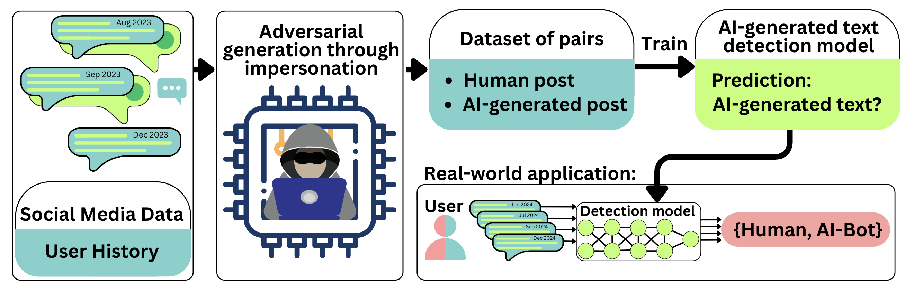

# LLM Bot Detection

<p align="center"></p>

Research pipeline for detecting LLM-generated content on social media (Telegram, Reddit). Covers data collection, synthetic data generation via persona-based LLM prompting, and training/evaluation of multiple detection models.

## Repository Layout

```
findai/                          # Core library for content generation
├── entities.py                  # Data models
├── constants.py                 # Persona prompt templates
└── modules/
    ├── user_profiler.py         # LLM-based persona generation
    ├── content_generator.py     # Few-shot content generation
    └── sample_selector.py       # Semantic similarity-based sample selection

experiments/
├── data_collection/             # Phase 1 — scrape raw data
│   ├── 00_reddit_data_collection.ipynb
│   ├── 01_telegram_processing.ipynb
│   └── 02_reddit_processing.ipynb
├── data_generation/             # Phase 2 — build synthetic dataset
│   ├── 01_tg_prepare_persona_and_prompt.py
│   ├── 02_reddit_prepare_persona_and_prompt.py
│   ├── 03_multi_model_batches_creation.ipynb
│   ├── 04_multi_model_batch_generation.ipynb
│   ├── 05_joining_and_processing.ipynb
│   ├── 06_filtering.ipynb
│   ├── 07_eda_splitting.ipynb
│   └── 08_self_reveal_pattern_generation.ipynb
└── model_training/              # Phase 3 — train & evaluate detectors
    ├── 01_gecscore/
    ├── 02_binoculars/
    ├── 03_fastdetectgpt/
    ├── 04_osmdet/               # Inference for OSM-Det model
    ├── 05_tbc_ms/               # XLM-RoBERTa based on Multisocial Dataset
    ├── 06_lfc/                  # Language features based classifier
    ├── 07_tbc/                  # BERT / RoBERTa / Gemma (LoRA) classifiers on our dataset
    └── 08_metrics_calculation.ipynb

data/                            # Raw → processed → train/test splits (not in git)
models/                          # Trained model checkpoints (not in git)
scores/                          # Detector output scores (not in git)
```